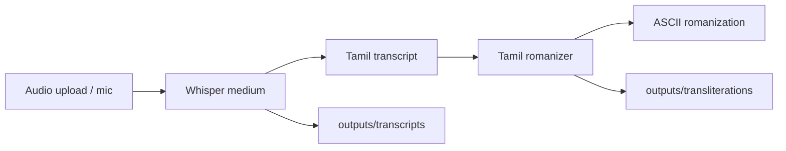

# VoiceNote AI — Transliteration

Tamil voice-note pipeline: **Whisper ASR** (Tamil transcript) plus **custom Tamil-to-ASCII romanization**, served through a **Gradio** web UI. This is **script transliteration**, not translation into another language.

There is **no LLM** in the current app path—only speech recognition and romanized output.

---

## Features

- Upload or record Tamil audio in the browser
- One-click **Transcribe & Transliterate**
- Built-in sample via **Try with sample audio** (`sample_inputs/sample.wav`)
- Long audio handled with **chunking** and a bounded in-memory queue
- Timestamped `.txt` files under `outputs/transcripts` and `outputs/transliterations`

---

## How it works



1. **ASR** — `openai/whisper-medium` transcribes audio with `language=ta`.
2. **Chunking** — Files longer than ~30s are split with `pydub`; chunks are processed in batches (queue size from config) and joined.
3. **Transliteration** — `app/tamil_romanizer.py` maps Tamil graphemes to Tamil-aware Latin (ASCII), e.g. `நான் சாப்பிட்டேன்` → `naan saappittaen`.
4. **UI** — Gradio shows both text fields; files are saved on each successful run.

---

## Prerequisites

| Requirement | Notes |
|-------------|--------|
| **Python** | 3.10+ recommended; 3.13 works with pinned Gradio stack in `requirements.txt` |
| **ffmpeg** | Required by Whisper / `pydub` for many formats (install via OS package manager) |
| **Disk / network** | First run downloads the Whisper `medium` weights (~1.5 GB) |

**GPU (optional):** Set `"device": "cuda"` in `models/model_config.py` if PyTorch sees a CUDA device.

---

## Run locally

```bash
python3 -m venv venv
source venv/bin/activate   # Windows: venv\Scripts\activate
pip install -r requirements.txt
python app/main.py
```

Open: **http://localhost:7860**

The first transcription may take a while while the model loads and (on first use) downloads weights.

---

## Docker

```bash
docker compose up --build
```

- **URL:** http://localhost:7860  
- **Image:** Python 3.10, `ffmpeg` and `curl` included  
- **Volumes:** `./outputs` and `./sample_inputs` mounted into the container  
- **Healthcheck:** HTTP probe on port 7860 (allow ~60s on first start for model load)

Stop with `Ctrl+C` or `docker compose down`.

---

## Configuration

All runtime settings for the Gradio app live in **`models/model_config.py`** (not environment variables).

| Section | Key settings | Purpose |
|---------|----------------|---------|
| `ASR_CONFIG` | `model_id`, `language`, `device` | Whisper model and Tamil (`ta`) transcription |
| `BUFFER_CONFIG` | `max_queue_size`, `chunk_duration`, `sample_rate` | Long-audio chunking and batch size |
| `TRANSLITERATION_CONFIG` | `src_script`, `tgt_script` | Romanization scheme labels |
| `APP_CONFIG` | `host`, `port`, `share`, output paths | Gradio bind address and folders |

**Common tweaks:**

```python
# Use GPU when available
ASR_CONFIG["device"] = "cuda"

# Smaller/faster model (less accurate)
ASR_CONFIG["model_id"] = "openai/whisper-small"

# Public Gradio link (temporary share URL)
APP_CONFIG["share"] = True
```

Docker Compose sets `GRADIO_SERVER_NAME` and `GRADIO_SERVER_PORT`; the app still reads host/port from `APP_CONFIG` in code.

---

## Project structure

```
VoiceNote-AI/
├── app/
│   ├── main.py              # Entry point
│   ├── interface.py         # Gradio UI
│   ├── asr_pipeline.py      # Whisper + chunked transcription
│   ├── transliteration.py   # Romanization pipeline
│   ├── tamil_romanizer.py   # Grapheme → ASCII mapping
│   ├── buffer_manager.py    # Chunk queue for long audio
│   └── utils.py             # Validation, splitting, file I/O
├── models/
│   └── model_config.py      # Central config
├── sample_inputs/           # Example audio (e.g. sample.wav)
├── outputs/                 # Generated files (gitignored)
│   ├── transcripts/
│   └── transliterations/
├── tests/
│   └── test_pipeline.py
├── Dockerfile
├── docker-compose.yml
└── requirements.txt
```

Legacy folders (`core/`, `config.py`, etc.) may remain from an earlier Streamlit + Groq version; the **active** path is `python app/main.py` only.

---

## Sample audio

1. Place a file at `sample_inputs/sample.wav` (or update the path in `app/interface.py` → `gr.Examples`).
2. In the UI, use **Try with sample audio**, then **Transcribe & Transliterate**.

Supported inputs depend on `ffmpeg` and Gradio’s audio widget (common formats: WAV, MP3, M4A, etc.).

---

## Outputs

Each successful run writes:

- `outputs/transcripts/transcript_YYYYMMDD_HHMMSS.txt` — Tamil Unicode text  
- `outputs/transliterations/transliteration_YYYYMMDD_HHMMSS.txt` — ASCII romanization  

The `outputs/` directory is ignored by git so local runs are not committed.

---

## Tests

```bash
source venv/bin/activate
pytest tests/test_pipeline.py -v
```

Covers buffer queue behavior, transliteration (ASCII output), utilities, and directory setup.

---

## Troubleshooting

| Issue | What to try |
|-------|-------------|
| **`ffmpeg` not found** | Install: `brew install ffmpeg` (macOS), `apt install ffmpeg` (Debian/Ubuntu) |
| **`HfFolder` / `huggingface-hub` errors** | Use `requirements.txt` as pinned (`huggingface-hub<1.0`) |
| **Gradio schema / `TypeError` on launch** | Keep Gradio 4.44.x and pinned FastAPI/Starlette/Pydantic from `requirements.txt` |
| **Broken venv / wrong Python** | Delete `venv/`, recreate, reinstall requirements |
| **Empty or corrupt audio** | Re-export as WAV; check file size > 0 |
| **Very slow on CPU** | Expect long runs on `medium`; try `whisper-small` in config or enable CUDA |
| **Port 7860 in use** | Change `APP_CONFIG["port"]` or stop the other process |
| **Docker healthcheck failing** | Wait for first model download; check logs with `docker compose logs -f` |

---

## Related work

This repo mirrors the **Task 2 ASR + transliteration** flow from the indic-translation-asr internship project: Whisper for Tamil ASR and an in-house romanizer instead of an external transliteration API.

---

## License

See repository defaults; add a `LICENSE` file if you publish formally.
