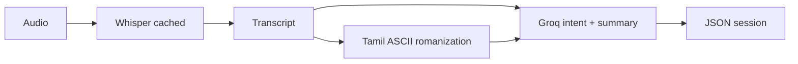

# 🎙️ VoiceNote AI

VoiceNote AI is a multilingual AI voice-note assistant that records or accepts audio, transcribes speech using Whisper (with caching and long-audio chunking), optionally romanizes Tamil script to ASCII, extracts structured intent using Groq LLMs, summarizes the note, and saves the complete session as JSON.

It is designed for English, Tamil, Tanglish, and multilingual voice notes.

---

## 🚀 What It Does

VoiceNote AI converts raw speech into structured, useful notes.

Example:

You speak:

> எனக்கு இப்ப மிகவும் கோபமாக வருகிறது

The system produces a structured note (saved as `outputs/session_<id>.json`):

```json
{
  "session_id": "session_a1b2c3d4",
  "raw_transcript": "எனக்கு இப்ப மிகவும் கோபமாக வருகிறது",
  "transliteration": "enakku ippa mikavum kobamaaka varukirathu",
  "intent": {
    "intent": "personal_note",
    "subject": "feeling angry now",
    "content_type": "note",
    "language_detected": "Tamil",
    "confidence": "high"
  },
  "summary": "The user is currently feeling very angry.",
  "key_points": ["The user is expressing strong anger right now."],
  "action_items": [],
  "suggested_title": "Feeling Angry",
  "asr_meta": {
    "chunked": false,
    "chunk_count": 1,
    "model": "small"
  }
}
```

---

## ✨ Features

- 🎙️ Record voice notes directly in Streamlit
- 📁 Upload audio files (WAV, MP3, M4A, OGG, FLAC)
- 🧠 Whisper ASR with **cached models** (faster repeat runs) and **chunked** processing for long audio
- 🔤 Optional **Tamil → ASCII romanization** (transliteration, not translation)
- ⚡ Groq LLM for intent, summary, key points, and action items
- 🌐 English, Tamil, Tanglish, and mixed-language speech (optional Whisper language hint)
- 📊 **Staged UI**: transcript appears before Groq analysis finishes
- 📜 **Session history** in the sidebar (browse past `outputs/session_*.json`)
- 💾 JSON sessions plus downloadable plain-text export
- 🖥️ Streamlit app, CLI scripts, and Docker Compose

---

## 🧠 Core Idea

Most note-taking apps only store audio or text. VoiceNote AI adds:

1. **Accurate transcription** (Whisper, tuned for voice notes and Tamil/Tanglish)
2. **Readable romanization** when the transcript contains Tamil script
3. **Structured understanding** (intent + summary via Groq)

Use cases: personal notes, voice journaling, reminders, meeting notes, multilingual capture.

---

## 🏗️ System Architecture



| Stage | What happens |
|--------|----------------|
| ASR | Short audio: one Whisper call. Long audio (&gt;30s default): split with pydub, transcribe in bounded batches, join text. |
| Romanization | If Tamil script is detected, `tamil_romanizer` produces ASCII Latin (optional Groq hint). |
| Analysis | Groq returns intent + summary JSON; normalized and saved. |

This repo converges ideas from [task2 ASR + transliteration](https://github.com/samadarsh/indic-translation-asr-project/tree/main/task2_asr_transliteration) (chunked Whisper + Tamil romanizer) with VoiceNote AI’s Groq structured-note layer.

---

## 📦 Repository Structure

```text
VoiceNote-AI/
├── config.py                      # Env-driven defaults
├── app.py                         # Streamlit (staged ASR → analysis, history sidebar)
├── core/
│   ├── whisper_service.py         # Cached Whisper + chunked transcription
│   ├── audio_chunker.py           # Long-audio splitting (pydub)
│   ├── buffer_manager.py          # Bounded batch queue for chunks
│   ├── tamil_romanizer.py         # Tamil → ASCII grapheme mapper
│   ├── transliteration.py         # Optional romanization after ASR
│   ├── pipeline.py                # transcribe → analyze → save
│   ├── transcriber.py              # Public transcribe API
│   ├── voice_note_analyzer.py     # Groq intent + summary
│   ├── groq_client.py             # API key validation (gsk_…)
│   ├── intent_parser.py
│   ├── note_summarizer.py
│   ├── text_utils.py
│   └── logging_config.py
├── storage/session_store.py       # JSON sessions + history helpers
├── scripts/
│   ├── record_and_transcribe.py
│   └── transcribe_file.py
├── tests/                         # Unit tests (romanizer, config, Groq key format, …)
├── docker-compose.yml
├── Dockerfile
├── requirements.txt
├── .env.example                   # Template — copy to .env
└── outputs/                       # session_*.json (gitignored in normal use)
```

---

## ✅ Prerequisites

- Python 3.10+ (tested with 3.11 / 3.13)
- [FFmpeg](https://ffmpeg.org/) (Whisper + pydub)
- [PortAudio](http://www.portaudio.com/) (CLI microphone only)
- A valid [Groq API key](https://console.groq.com/keys) (`gsk_…`)

```bash
# macOS
brew install ffmpeg portaudio

# Ubuntu / Debian
sudo apt update
sudo apt install ffmpeg libportaudio2
```

---

## ⚙️ Installation

```bash
git clone https://github.com/samadarsh/VoiceNote-AI.git
cd VoiceNote-AI

python -m venv venv
source venv/bin/activate   # Windows: venv\Scripts\activate

pip install -r requirements.txt

cp .env.example .env
# Edit .env — set GROQ_API_KEY to your real gsk_ key (see below)
```

---

## 🔐 Environment Variables

Copy `.env.example` to `.env` in the **project root** (same folder as `app.py`).

| Variable | Required | Default | Description |
|----------|----------|---------|-------------|
| `GROQ_API_KEY` | **Yes** | — | Must be a real key from [Groq Console](https://console.groq.com/keys), format `gsk_…` |
| `GROQ_MODEL` | No | `llama-3.1-8b-instant` | Groq chat model for analysis |
| `WHISPER_MODEL` | No | `small` | Default Whisper size for auto-detect / English |
| `WHISPER_MODEL_TAMIL` | No | `medium` | Used when language hint is Tamil and model is still the default |
| `WHISPER_DEVICE` | No | auto (`cuda` if available) | Force `cpu` or `cuda` |
| `WHISPER_FP16` | No | `false` on CPU | Set `true` for GPU runs |
| `CHUNK_DURATION_SEC` | No | `30` | Max seconds per ASR chunk |
| `BUFFER_MAX_QUEUE` | No | `10` | Chunks per ASR batch |
| `OUTPUTS_DIR` | No | `outputs` | Session JSON directory |
| `LOG_LEVEL` | No | `INFO` | Logging verbosity |

Example `.env`:

```bash
GROQ_API_KEY=gsk_xxxxxxxxxxxxxxxxxxxxxxxxxxxxxxxx
GROQ_MODEL=llama-3.1-8b-instant
WHISPER_MODEL=small
WHISPER_MODEL_TAMIL=medium
```

**Streamlit Cloud** — use app secrets (see `.streamlit/secrets.toml.example`; do not commit real keys):

```toml
GROQ_API_KEY = "gsk_xxxxxxxxxxxxxxxxxxxxxxxxxxxxxxxx"
GROQ_MODEL = "llama-3.1-8b-instant"
```

After changing `.env`, **restart Streamlit** (`Ctrl+C`, then `streamlit run app.py`).

The sidebar shows **Groq: Configured (gsk_xxxx…yyyy)** when the key looks valid, or a warning if it is missing or still a placeholder.

---

## ▶️ Usage

### Streamlit web app

```bash
streamlit run app.py
```

Open the URL shown (usually `http://localhost:8501`). In the sidebar:

- Choose **Whisper model** and **language hint** (Tamil hint can use `medium` automatically)
- Enable **Force chunked ASR** for long recordings
- Browse **History** for past sessions
- Use **Clear cached Whisper model** if you switch model size and want a fresh load

Processing is staged: you see the **transcript** (and romanization if applicable) before Groq analysis completes.

### CLI — record a note

```bash
python scripts/record_and_transcribe.py --once
```

### CLI — transcribe a file

```bash
# Transcribe only
python scripts/transcribe_file.py path/to/audio.wav

# Full pipeline + save JSON
python scripts/transcribe_file.py path/to/audio.wav --language ta --analyze --save

# Tamil ASR + romanization, no Groq
python scripts/transcribe_file.py path/to/audio.wav --transliterate-only

# Long audio
python scripts/transcribe_file.py path/to/long.wav --chunked --analyze --save
```

### Docker

```bash
docker compose up --build
```

Ensure `.env` exists beside `docker-compose.yml` with a valid `GROQ_API_KEY`. The `outputs/` folder is mounted as a volume.

### Tests

```bash
python -m unittest discover -s tests -v
# or: pip install pytest && pytest tests/ -v
```

---

## 🔧 Troubleshooting

### `Invalid API Key` / Groq 401

| Cause | Fix |
|--------|-----|
| Placeholder in `.env` (`your_groq_api_key_here`) | Replace with a real `gsk_` key from [console.groq.com/keys](https://console.groq.com/keys) |
| `.env` not in project root | Place `.env` next to `app.py`, not only `.env.example` |
| Streamlit not restarted | Stop and rerun `streamlit run app.py` after editing `.env` |
| Extra quotes or spaces | Use `GROQ_API_KEY=gsk_abc...` with no quotes unless your shell requires them |
| Revoked or wrong key | Create a new key in the Groq console |

If **transcription works** but analysis fails, Whisper is fine — only the Groq key needs fixing.

### Slow first transcription

Whisper downloads model weights on first use. `medium` is ~1.5GB. Use `tiny` or `small` in the sidebar for faster CPU trials.

### `No module named 'groq'` / `pydub`

```bash
pip install -r requirements.txt
```

### FFmpeg errors

Install FFmpeg and ensure `ffmpeg` is on your `PATH` (`ffmpeg -version`).

---

## ⚠️ Limitations

- Whisper quality depends on mic, noise, and accent.
- Large Whisper models are slow on CPU; defaults favor `small` / `medium` (Tamil).
- Romanization is **transliteration** (script change), not English translation.
- Chunked ASR uses temporary WAV files under the system temp directory.
- Not aimed at music transcription or multi-speaker diarization.
- Sessions are JSON files under `outputs/`, not a database (see roadmap).

---

## 🛣️ Roadmap

- SQLite (or similar) for searchable note history
- Speaker labels for meeting-style audio
- Export to Markdown / PDF

---

## 🤝 Contributing

Fork the repository, create a feature branch, make your changes, and open a pull request. Run `python -m unittest discover -s tests -v` before submitting.

---

## 📄 License

This project is licensed under the MIT License. See [LICENSE](LICENSE) for details.
