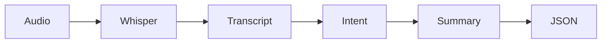

# 🎙️ VoiceNote AI

VoiceNote AI is a multilingual AI voice-note assistant that records or accepts audio, transcribes speech using Whisper, extracts structured intent using Groq LLMs, summarizes the note, and saves the complete session as JSON.

It is designed for English, Tamil, Tanglish, and multilingual voice notes.

---

## 🚀 What It Does

VoiceNote AI converts raw speech into structured, useful notes.

Example:

You speak:

> எனக்கு இப்ப மிகவும் கோபமாக வருகிறது

The system produces a structured note:

```json
{
  "cleaned_transcript": "எனக்கு இப்ப மிகவும் கோபமாக வருகிறது",
  "intent": {
    "intent": "personal_note",
    "subject": "feeling angry now",
    "content_type": "note",
    "language_detected": "Tamil",
    "confidence": "high"
  },
  "short_summary": "The user is currently feeling very angry.",
  "key_points": [
    "The user is expressing strong anger right now."
  ],
  "action_items": [],
  "important_entities": [
    "anger"
  ],
  "language_detected": "Tamil",
  "suggested_title": "Feeling Angry"
}
```

---

## ✨ Features

- 🎙️ Record voice notes directly in Streamlit
- 📁 Upload audio files such as WAV, MP3, M4A, OGG, and FLAC
- 🧠 Transcribe speech using OpenAI Whisper
- ⚡ Extract structured intent using Groq-hosted LLMs
- 📝 Generate summaries, key points, and action items
- 🌐 Supports English, Tamil, Tanglish, and mixed-language speech
- 💾 Saves every session as JSON inside the `outputs/` folder
- 🖥️ Includes both Streamlit app and CLI workflow

---

## 🧠 Core Idea

Most note-taking apps only store audio or text.

VoiceNote AI goes one step further.

It understands what the user said and converts it into a structured note that can later be used for:

- Personal note tracking
- Voice journaling
- Task extraction
- Meeting note summarization
- Multilingual speech understanding
- AI assistant workflows

---

## 🏗️ System Architecture



---

## 📦 Repository Structure

```text
voice-note-ai/
├── app.py                    # Streamlit web app
├── core/                     # Core AI & Business Logic
│   ├── transcriber.py        # Whisper transcription logic
│   ├── voice_note_analyzer.py# Combined Groq intent + summary analysis
│   ├── intent_parser.py      # Intent schema and normalization helpers
│   ├── note_summarizer.py    # Summary schema and normalization helpers
│   ├── text_utils.py         # Shared JSON and multilingual text helpers
│   └── groq_client.py        # Reused Groq client singleton
├── storage/                  # Data Persistence
│   └── session_store.py      # Session ID and JSON saving helpers
├── scripts/                  # CLI Tools
│   ├── record_and_transcribe.py # CLI recorder workflow
│   └── transcribe_file.py    # Transcribe and process existing audio files
├── requirements.txt          # Python dependencies
├── .github/workflows/ci.yml  # Compile-only CI check
├── .env.example              # Example environment variables
└── outputs/                  # Sample saved session JSON files
```

---

## ✅ Prerequisites

- Python 3.10 or newer. Tested locally with Python 3.13.
- FFmpeg, required by Whisper for audio processing
- PortAudio, required by `sounddevice` for CLI microphone recording
- A Groq API key

Install system dependencies:

```bash
# macOS
brew install ffmpeg
brew install portaudio

# Ubuntu / Debian
sudo apt update
sudo apt install ffmpeg
sudo apt install libportaudio2
```

---

## ⚙️ Installation

Clone the repository:

```bash
git clone https://github.com/samadarsh/voice-note-ai.git
cd voice-note-ai
```

Create and activate a virtual environment:

```bash
python -m venv venv
source venv/bin/activate
```

Install dependencies:

```bash
pip install -r requirements.txt
```

---

## 🔐 Environment Variables

For local development, create a `.env` file in the project root:

```bash
GROQ_API_KEY=your_groq_api_key_here
GROQ_MODEL=llama-3.1-8b-instant
```

For Streamlit Cloud, add the same key in app secrets:

```toml
GROQ_API_KEY = "your_groq_api_key_here"
GROQ_MODEL = "llama-3.1-8b-instant"
```

---

## ▶️ Usage

Run the Streamlit web app:

```bash
streamlit run app.py
```

Record and process a voice note from the CLI:

```bash
python scripts/record_and_transcribe.py --once
```

Transcribe and process an existing audio file:

```bash
python scripts/transcribe_file.py path/to/audio.wav --analyze
```

For Tamil-heavy audio, you can pass a Whisper language hint:

```bash
python scripts/transcribe_file.py path/to/audio.wav --language ta --analyze
```

Analyze and save an existing audio file:

```bash
python scripts/transcribe_file.py path/to/audio.wav --save
```

---

## ⚠️ Limitations

- Whisper accuracy depends on audio quality, background noise, accent, and speech clarity.
- Local Whisper models can be slow on CPU-only machines, especially for longer audio.
- The app is optimized for spoken voice notes, not music transcription or multi-speaker diarization.
- Session data is currently saved as JSON files in `outputs/`, not a database.

---

## 🛣️ Roadmap

- Add SQLite storage for searchable note history.
- Add asynchronous processing in Streamlit so long transcriptions do not block the UI.
- Add speaker labels for meeting-style recordings.
- Add export options for Markdown, PDF, or Notion-style notes.

---

## 🤝 Contributing

Contributions are welcome. Fork the repository, create a feature branch, make your changes, and open a pull request with a clear description of what changed and why.

---

## 📄 License

This project is licensed under the MIT License. See [LICENSE](LICENSE) for details.
